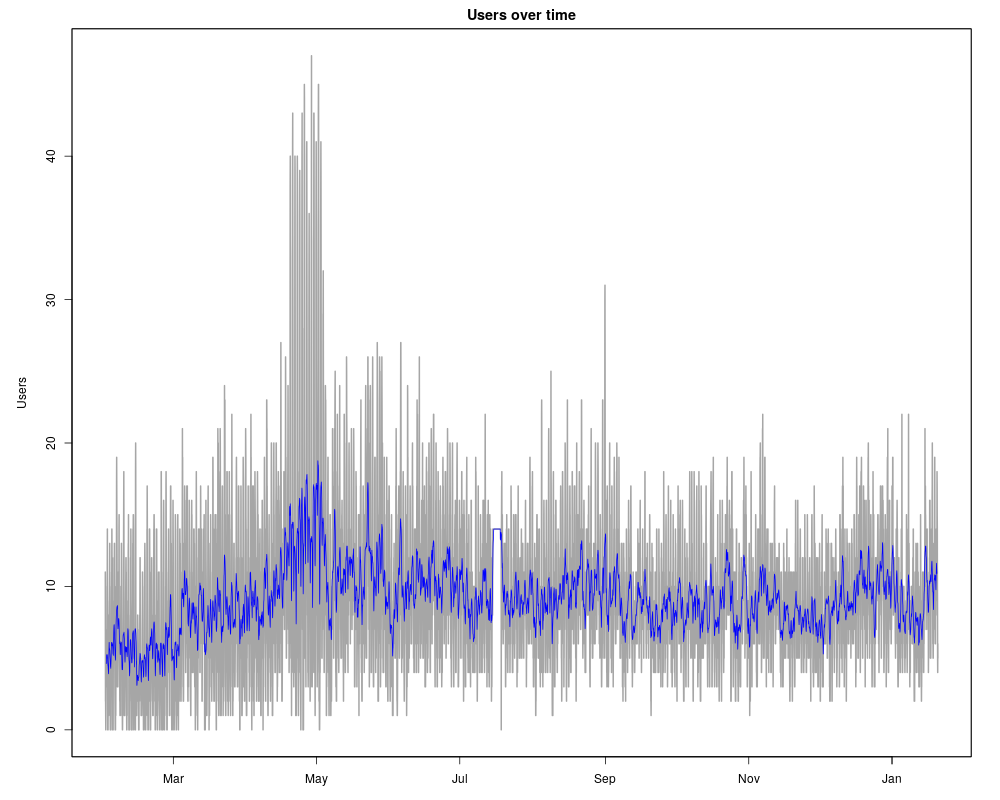

# LogAnalyze

Produces graphs of number of concurrently online users for TeamSpeak

## Requirements

- Rust & cargo installation
- R language interpreter
- rsync

## Usage

```
./run.sh
```

## Example output


